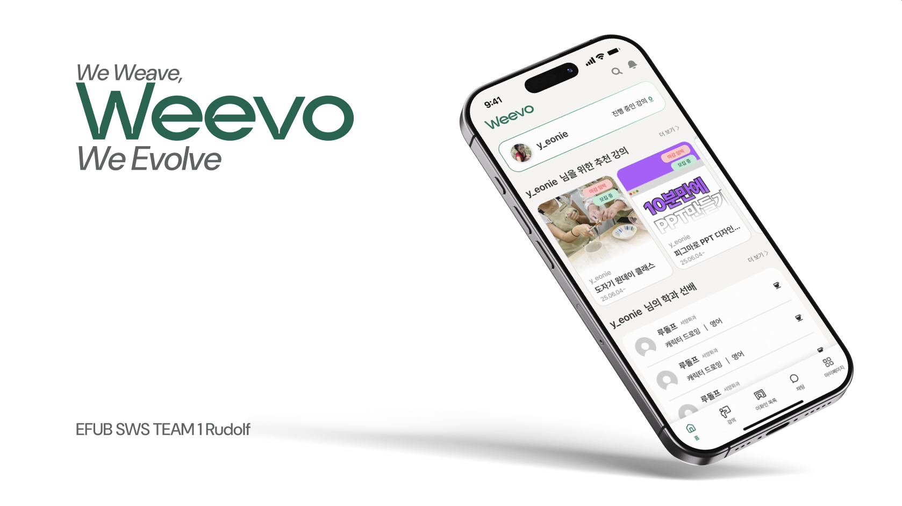
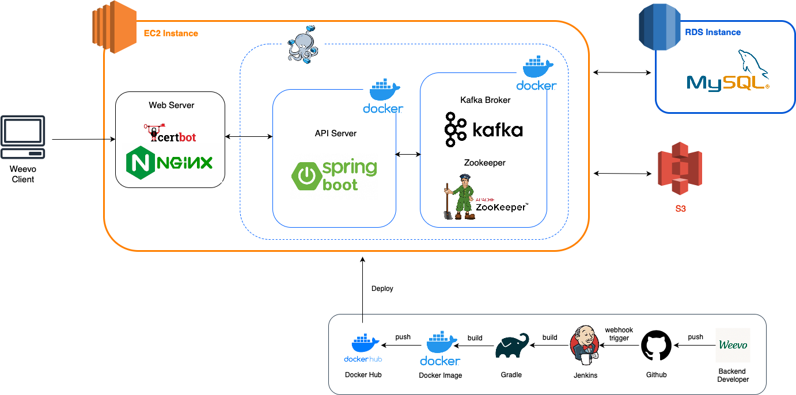

# 🌳 Weevo Backend

## EFUB 5기 SWS 1팀 Weevo 백엔드 레포지토리입니다.
### 프로젝트 소개

### *Weevo*
> *We Weave, We Evolve.*
>

이화인들이 서로의 재능 · 경험을 ‘직조(weave)’하듯 엮어 함께 성장(Evolve)한다는 의미를 담았습니다.  
이름 속 ‘we’는 함께 배우고, 함께 성장하는 우리를 의미하며, Weevo = We + Evolve라는 해석 또한 가능해 우리의 배움과 변화, 진화를 함축하는 의미도 동시에 담고 있습니다. 
서로 다른 재능이 실처럼 얽히고 교차하면서, 이화인 사이의 배움과 교류가 하나의 직조물처럼 완성되기를 바랍니다.

### 📆 개발 기간
***
2025.07.01 - 2025.08.08

### 👩‍💻 팀원 소개
***
|  |  |  |  |
|-------------------------------------------------|-------------------------------------------------------|------------------------------------------------|---------------------------------------------------|
| [@gimye](https://github.com/gimye)              | [@m2nsp](https://github.com/m2nsp)                    | [@laura-jung](https://github.com/laura-jung)   | [@s2eojeong](https://github.com/s2eojeong)        |
| 김예린                                             | 박민서                                                   | 정윤아                                            | 조서정                                               |
| 로그인/회원가입, 강의 관련 api 개발                          | 마이페이지 관련 api, 로그아웃/회원탈퇴                               | 추가 회원가입 , 이화인 목록 조회, 이화인 개별 조회                 | 실시간 채팅 관련 웹소캣 api 개발, 알림 api 개발, CI/CD 구축 및 서버 배포 |

### ⚙️ 시스템 아키텍처
***

### 🛠️ 기술 스택
***
DEVELOP  

 (+)zookeeper

DEPLOY  

### 🗂️프로젝트 구조
***
<pre>
📂 Weevo_BE                                                                                               
┣ 📂 src                                                                                                  
┃ ┣ 📂 main                                                                                               
┃ ┃ ┣ 📂 java                                                                                             
┃ ┃ ┃ ┗  📂 com.rudolph.Weevo                                                                             
┃ ┃ ┃  ┗ 📜 WeevoApplication.java   ** 각 폴더의 구조 동일 (global폴더 및 auth의 security폴더 제외)                
┃ ┃ ┃       ┣ 📂 auth              //인증 관련                                                              
┃ ┃ ┃       ┃ ┣ 📂controller                                                                              
┃ ┃ ┃       ┃ ┣ 📂domain                                                                                  
┃ ┃ ┃       ┃ ┣ 📂dto                                                                                     
┃ ┃ ┃       ┃ ┣ 📂repository                                                                              
┃ ┃ ┃       ┃ ┣ 📂service                                                                                 
┃ ┃ ┃       ┃ ┗ 📂security                                                                                
┃ ┃ ┃       ┣ 📂 chat             //채팅 관련                                                               
┃ ┃ ┃       ┣ 📂 course           //강의 관련                                                               
┃ ┃ ┃       ┣ 📂 member           //회원정보&프로필 관련                                                       
┃ ┃ ┃       ┣ 📂 notification     //알림 관련                                                               
┃ ┃ ┃       ┣ 📂 search           //검색 관련                                                               
┃ ┃ ┃       ┣ 📂 tag              //태그 관련                                                               
┃ ┃ ┃       ┗ 📂 global           //전역 요소들                                                              
┃ ┃ ┗ 📂 resources                                                                                        
┃ ┃ ┃ ┗ 📂 static                                                                                         
┃ ┃ ┃   ┗ 📜image.png                                                                                     
┃ ┃ ┗ 📜 application.yml                                                                                  
┃ ┗ 📂 test                                                                                               
┣ 📜 build.gradle                                                                                         
┗ 📜 README.md                                                                                            
</pre>